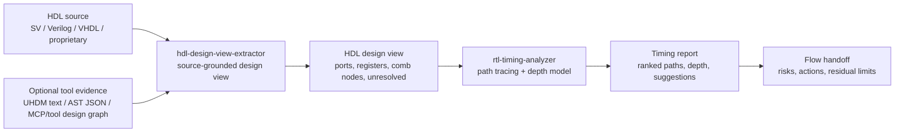
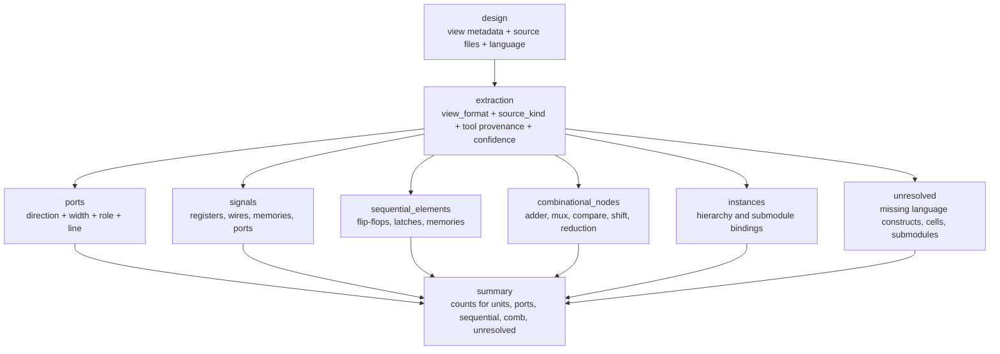

# RTL Timing Risk Evaluation Flow Report

## Executive Summary

The `pre-synthesis-timing-risk` flow is an AI-orchestrated workflow for early RTL
timing risk evaluation. It converts HDL source or tool-produced textual design views into
source-grounded structural evidence, runs focused timing-depth evaluation, and
emits a final timing-risk handoff.

The flow is designed for pre-synthesis use. It identifies likely timing-risk
structures before synthesis or STA exists, but it does not claim real slack,
signoff timing, or physical implementation behavior.

Related artifacts:

- Flow contract: [pre-synthesis-timing-risk/FLOW.md](../flows/pre-synthesis-timing-risk/FLOW.md)
- Design-view extractor skill: [hdl-design-view-extractor/SKILL.md](../skills/hdl-design-view-extractor/SKILL.md)
- Timing analyzer skill: [rtl-timing-analyzer/SKILL.md](../skills/rtl-timing-analyzer/SKILL.md)
- Flow smoke case: [simple-counter metadata](../evals/smoke-flows/pre-synthesis-timing-risk/simple-counter/metadata.json)
- Draw.io source: [rtl-timing-risk-evaluation-flow.drawio](diagrams/rtl-timing-risk-evaluation-flow.drawio)
- HTML report: [rtl-timing-risk-evaluation-flow-report.html](rtl-timing-risk-evaluation-flow-report.html)

## Engineering Intent

The flow separates orchestration from reusable timing-risk evaluation:

- `hdl-design-view-extractor` produces an AI-readable textual design view.
- `rtl-timing-analyzer` consumes an existing design view or small visible RTL
  block and reports structural timing paths.
- `pre-synthesis-timing-risk` decides how to chain extraction, evaluation,
  unresolved-object handling, and final handoff.

This split keeps skills narrow while allowing the flow to handle real-world
agentic decisions such as whether to use UHDM, AST JSON, an MCP/tool-provided
textual design graph, or a model-derived view from raw HDL.

## System Context



## Draw.io Architecture Diagram

The Draw.io source is stored as a textual `.drawio` file for review and reuse:

```xml
<mxfile host="app.diagrams.net" modified="2026-04-27T00:00:00.000Z" agent="Codex" version="24.7.17">
  <diagram id="rtl-timing-risk-evaluation-flow" name="RTL Timing Risk Evaluation Flow">
    <!-- Full editable source: docs/diagrams/rtl-timing-risk-evaluation-flow.drawio -->
  </diagram>
</mxfile>
```

## Design View Output Model



## Data Contracts

| Artifact | Producer | Consumer | Schema / Contract |
| --- | --- | --- | --- |
| HDL source or tool output | User, repo fixture, MCP, parser | `pre-synthesis-timing-risk` | Input contract in flow |
| HDL design view | `hdl-design-view-extractor` | `rtl-timing-analyzer` | `schemas/hdl-design-view.schema.json` |
| Timing report | `rtl-timing-analyzer` | `pre-synthesis-timing-risk` | `schemas/timing-report.schema.json` |
| Final flow handoff | `pre-synthesis-timing-risk` | User / downstream flow | `schemas/pre-synthesis-timing-risk.schema.json` |

## End-to-End Smoke Coverage

The current flow smoke case validates an artifact-level end-to-end path:

1. Input RTL: `datasets/fixtures/hdl-design-view/simple_counter.sv`
2. Intermediate design view:
   `evals/smoke/hdl-design-view-extractor/simple-counter/expected.yaml`
3. Intermediate timing report:
   `evals/smoke-flows/pre-synthesis-timing-risk/simple-counter/simple_counter_timing_report.yaml`
4. Final flow handoff:
   `evals/smoke-flows/pre-synthesis-timing-risk/simple-counter/expected.yaml`

The smoke layer validates structure and schema consistency. It does not yet
execute a live LLM or parser toolchain.

## Risk Classification Discipline

The final handoff uses risk language instead of STA language:

- `critical`, `hard`, `moderate`, `easy`, or `unresolved`
- estimated structural depth, not slack
- confidence and evidence, not hidden assumptions
- suggested RTL actions, not claims that synthesis will close timing

## Guardrails

The flow must not:

- claim real timing slack
- claim signoff timing
- infer false paths or multicycle paths without constraints
- trace through missing submodules or unknown cells as if they were known
- treat a model-derived proprietary-language view as fully elaborated proof

## Engineering Use

Use this flow when a designer wants early feedback such as:

- whether a feedback path contains too much arithmetic before a register
- whether a mux or priority chain is structurally risky
- whether missing hierarchy blocks meaningful timing estimation
- whether a candidate path should be pipelined before synthesis is available

The right output is a prioritized timing-risk handoff that helps decide what RTL
to inspect or restructure before spending synthesis and STA cycles.
